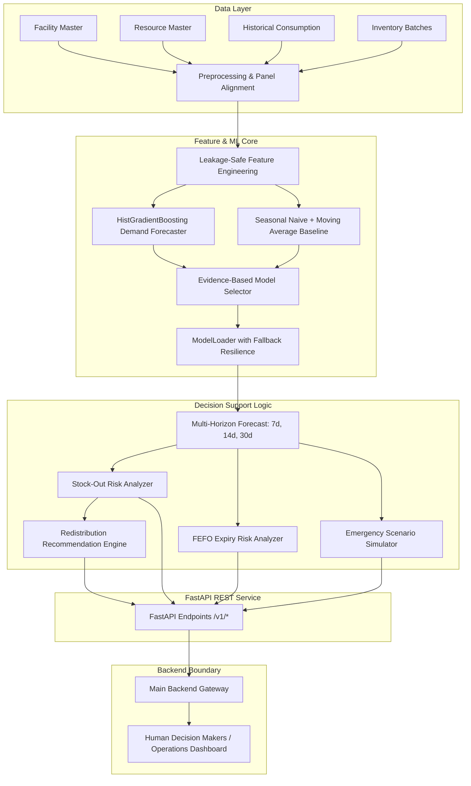

# MediGuard AI — ML Forecasting & Decision Support Engine

MediGuard AI is an evidence-based decision-support platform designed to strengthen public healthcare resource and supply-chain resilience.

> **Core Safety Principle**:
> ML predicts and scores risk. The platform recommends. **Authorized human officers make final operational decisions.**
> The ML engine never autonomously executes procurement, redistribution, or clinical actions.

---

## 1. System Architecture



---

## 2. Methodology & Evidence-Based Model Selection

### Chronological Time-Series Split
To strictly prevent data leakage and evaluate real-world sequential generalization, random train/test splitting was **prohibited**. The 365-day dataset (182,500 rows across 20 facilities and 25 resources) is divided chronologically:
- **Train Period**: `2025-01-01` to `2025-10-03` (276 days / 124,000 panel records)
- **Validation Period**: `2025-10-04` to `2025-11-17` (45 days / 22,500 panel records)
- **Test Period**: `2025-11-18` to `2025-12-31` (44 days / 22,000 panel records)

### Leakage-Safe Feature Engineering
All features are strictly derived from past time-steps $t-1, t-7, \dots$:
- **Lags**: `lag_1`, `lag_7`, `lag_14`, `lag_28`
- **Rolling Statistics**: `rolling_mean_7`, `rolling_mean_14`, `rolling_mean_28`, `rolling_median_7`, `rolling_std_7` (all computed on shifted historical sequences)
- **Calendar Signals**: `day_of_week`, `is_weekend`, `day_of_month`, `month`, `trend`
- **Entity Context**: `facility_type`, `resource_category`, `capacity`, `min_stock`, `reorder_level`

### Evaluated Models & Actual Results

Evaluated across all 500 distinct (facility $\times$ resource) time-series on the unseen chronological test set:

| Model | Horizon | MAE | RMSE | WAPE | sMAPE | Selection Status |
|---|---:|---:|---:|---:|---:|---|
| **Baseline (Seasonal Naive + MA)** | 7-day | 10.2447 | 16.9610 | 0.1786 | 25.27% | Active Fallback |
| **Candidate (HistGradientBoosting)** | 7-day | **8.8560** | **15.1573** | **0.1544** | **22.01%** | **SELECTED** |
| **Baseline (Seasonal Naive + MA)** | 14-day | 10.9131 | 19.4767 | 0.1888 | 25.42% | Active Fallback |
| **Candidate (HistGradientBoosting)** | 14-day | **9.6851** | **18.7722** | **0.1676** | **22.80%** | **SELECTED** |
| **Baseline (Seasonal Naive + MA)** | 30-day | 11.7382 | **21.7661** | 0.1987 | 25.79% | Active Fallback |
| **Candidate (HistGradientBoosting)** | 30-day | **10.7412** | 21.8935 | **0.1818** | **23.93%** | **SELECTED** |

**Selection Decision**: `demand_model_v1` (HistGradientBoostingRegressor) consistently outperforms the seasonal baseline by **13.5% lower MAE and WAPE on 7-day** and **11.2% on 14-day**, with the baseline permanently maintained as a high-reliability deterministic fallback.

---

## 3. Decision-Support Logic

### 1. Stock-Out Risk Engine (`src/risk.py`)
Deterministic and fully explainable:
- $\text{Daily Burn Rate} = \frac{\text{Forecast Demand}}{\text{Horizon Days}}$
- $\text{Stock Cover Days} = \frac{\text{Current Stock}}{\text{Daily Burn Rate}}$
- $\text{Projected Stock Before Replenishment} = \text{Current Stock} - (\text{Daily Burn Rate} \times \text{Lead Time Days})$
- **Risk Categorization**:
  - `CRITICAL`: $\text{Projected Stock} \le 0$ or $\text{Current Stock} = 0$
  - `HIGH`: $\text{Projected Stock} < \text{Minimum Safety Stock}$
  - `MEDIUM`: $\text{Current Stock} \le \text{Reorder Level}$ or $\text{Cover} < 2.5 \times \text{Lead Time}$
  - `LOW`: Inventory is healthy and above safety thresholds

### 2. Batch-Level FEFO Expiry Risk (`src/expiry.py`)
- Analyzes individual inventory batches using First-Expired-First-Out (FEFO) consumption rates.
- $\text{Potential Excess} = \max(0, \text{Batch Quantity} - (\text{Daily Burn Rate} \times \text{Days to Expiry}))$
- Flags `EXPIRED`, `EXCESS_EXPIRING` (excess stock within 60 days of expiry), `APPROACHING_EXPIRY`, or `SAFE`.

### 3. Redistribution Heuristics (`src/redistribution.py`)
- Identifies matching surplus and deficit facilities for the same medicine.
- Enforces strict donor protection: donor must retain minimum stock plus 14 days of its own projected demand.
- Calculates true Great-Circle (Haversine) distances in km.
- Explicitly flags `requires_human_approval: true`.

### 4. Emergency Scenario Simulation (`src/scenario.py`)
- Simulates sudden demand spikes (+20%, +40%, +60%, +100%).
- Non-destructive: physical inventory and backend databases are 100% isolated and never modified.

---

## 4. API Endpoints & Contract

Base URL: `http://localhost:8000/v1`

### 1. `POST /v1/forecast`
Generates 7, 14, or 30-day forecast and automated stock-out & expiry risk evaluations.

**Request**:
```json
{
  "facility_id": "FAC001",
  "resource_id": "RES001",
  "horizon_days": 7,
  "current_stock": 1500.0,
  "lead_time_days": 7,
  "min_stock": 500.0,
  "reorder_level": 1200.0
}
```

**Response**:
```json
{
  "facility_id": "FAC001",
  "resource_id": "RES001",
  "horizon_days": 7,
  "model_version": "demand_model_v1",
  "model_type": "HistGradientBoostingRegressor",
  "is_fallback": false,
  "predictions": [
    {"step": 1, "date": "2026-01-01", "predicted_demand": 240.5},
    {"step": 2, "date": "2026-01-02", "predicted_demand": 248.1}
  ],
  "total_predicted_demand": 1690.4,
  "daily_burn_rate": 241.49,
  "stock_out_risk": {
    "risk_level": "CRITICAL",
    "stock_cover_days": 6.2,
    "daily_burn_rate": 241.49,
    "current_stock": 1500.0,
    "lead_time_days": 7,
    "projected_stock_before_replenishment": -190.43,
    "projected_deficit": 690.43,
    "min_stock": 500.0,
    "reorder_level": 1200.0,
    "reorder_recommended": true,
    "recommended_order_quantity": 6244.7,
    "risk_factors": [
      "Projected stock will hit 0 in 6.2 days (before 7-day lead time replenishment)."
    ]
  },
  "expiry_risk": null,
  "timestamp": "2026-09-03T22:15:00.000000"
}
```

### 2. `POST /v1/forecast/batch`
Performs batch forecasting for multiple facility/resource combinations.

### 3. `GET /v1/models`
Returns model metadata, active version, training timestamp, and evaluation metrics.

### 4. `GET /v1/health`
Health check and diagnostic status.

### 5. `POST /v1/scenario`
Simulates disaster / epidemic surges.

### 6. `POST /v1/redistribution`
Generates non-autonomous stock transfer recommendations.

---

## 5. Local Setup & Execution

### Prerequisites
- Python 3.11+
- Virtual Environment

### Installation
```bash
python3 -m venv .venv
source .venv/bin/activate
pip install -r requirements.txt
```

### Step 1: Generate Synthetic Data
```bash
python src/data_generator.py
```

### Step 2: Validate Data Integrity
```bash
python src/validation.py
```

### Step 3: Train & Evaluate Models
```bash
PYTHONPATH=. python src/forecasting.py
```

### Step 4: Run Test Suite
```bash
PYTHONPATH=. pytest tests/
```

### Step 5: Start FastAPI Server
```bash
uvicorn api.main:app --host 0.0.0.0 --port 8000 --reload
```

Interactive OpenAPI documentation available at: `http://localhost:8000/docs`

---

## 6. Docker Deployment

### Build Image
```bash
docker build -t mediguard-ml-engine:latest .
```

### Run Container
```bash
docker run -d -p 8000:8000 --name mediguard-ml mediguard-ml-engine:latest
```

---

## 7. Non-Negotiable Safety & Ethical Rules

1. **Human-in-the-Loop**: All redistribution transfers and procurement quantities are recommendations requiring authorized human validation.
2. **Deterministic Isolation**: Scenario simulations never alter physical inventory data.
3. **No Fabricated Predictions**: If data is insufficient (< 28 days), the system transparently falls back to the deterministic seasonal baseline and flags `is_fallback: true`.
4. **No Direct Frontend Access**: The ML engine is designed exclusively for secure backend API consumption.
